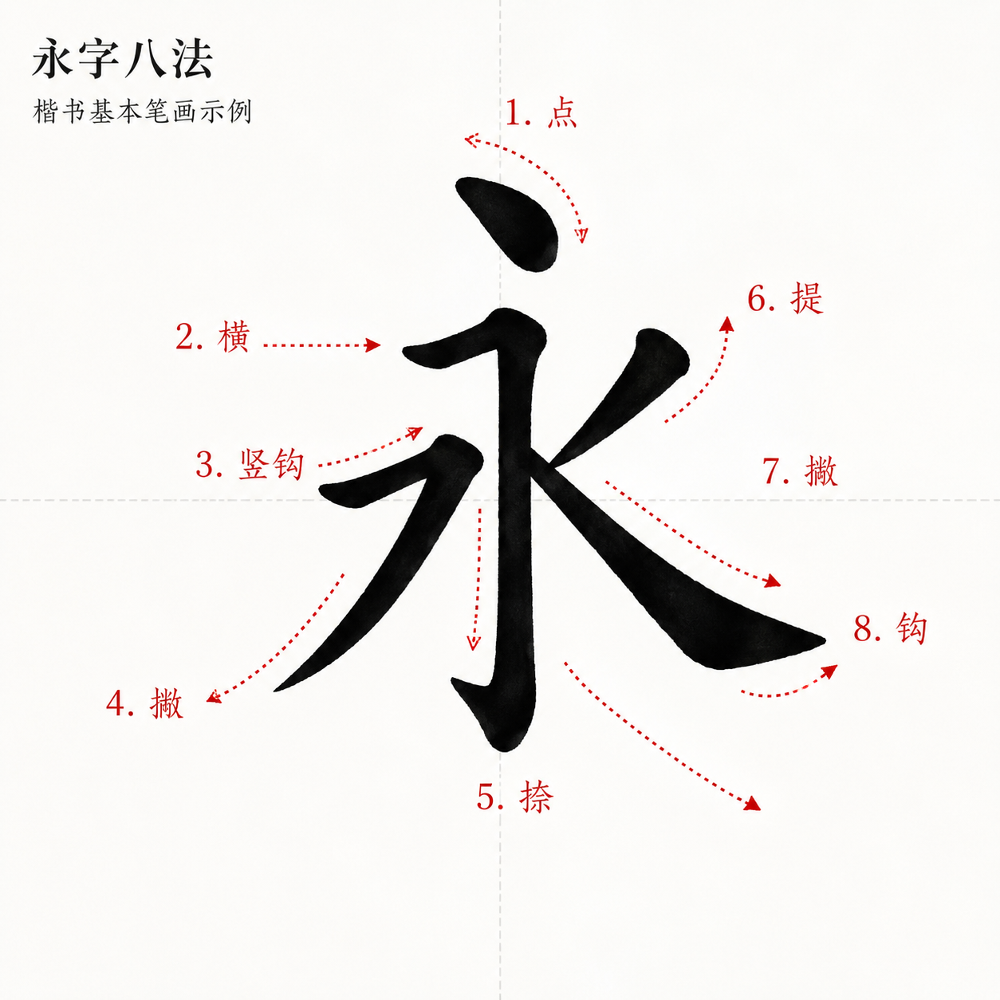

# MetalSolo (Part 2): Sacred Geometry of Stylus Input & Ink Engine Math / MetalSolo（第二篇）：触控笔输入与笔迹引擎的几何数学公式


<p style="text-align: center; margin: 0 0 32px;">
  <a href="https://apps.apple.com/ca/app/8strokes/id6774579880" target="_blank" rel="noopener" style="display: inline-block; padding: 12px 24px; background: #8b5cf6; color: #fff; font-weight: 600; border-radius: 99px; text-decoration: none;"> Download 8 Strokes (永字八法) on the App Store</a>
</p>

## Introduction: The Canvas is a Grid of Triangles / 导言：画布是三角形的网格

To a GPU, there is no such thing as an "ink stroke" or a "curved brush." The graphics hardware is a cold, mechanical calculator that understands only one fundamental shape: the triangle. 
对于 GPU 而言，世上本无“墨水笔迹”或“曲线笔刷”。图形硬件只是一个冰冷、机械的计算器，它只认一种最基础的形状：三角形。

Every elegant swirl of a calligraphy master, every dynamic sweep of the ink, must eventually be flattened, smooth-interpolated, and split into thousands of tiny triangles before it can be rendered to the screen.
书法大师落笔时的每一个优雅回锋，水墨流转的每一次动态挥洒，在被呈现在屏幕上之前，最终都必须经过扁平化、平滑插值，并拆解为数以千计的微小三角形。

In this second part of our engineering series, we dive deep into the math that powers the **8 Strokes** ink rendering engine. We discuss why we start with triangles and curves, dissect the math behind our Catmull-Rom smoothing spline, list the exact geometry equations used to generate variable-width ribbons, and explore the dynamic end-cap generation equations.
在工程技术系列的第二篇中，我们将深入探索为 **8 Strokes（永字八法）** 笔迹渲染引擎提供动力支持的底层数学。我们将讨论为何要从三角形和曲线讲起，剖析 Catmull-Rom 平滑样条线背后的数学公式，列出用于生成可变宽度三角带的精确几何方程，以及端点半圆的闭合几何方程。

---

## 1. Triangles & Curves: Why Them? / 1. 从三角形与曲线说起：为什么是它们？



When a calligrapher writes on an iPad, the hardware samples touch locations via the digitizer. Even with the high-frequency 240 Hz sampling rate of the Apple Pencil, drawing a rapid stroke produces a series of discrete, scattered points. 
当书法家在 iPad 上书写时，硬件通过电容屏对触摸位置进行采样。即使在 Apple Pencil 拥有 240 Hz 高频采样率的情况下，快速划过屏幕依然只会产生一系列离散、零散的触点。

If we simply connect these dots with straight lines, the resulting stroke looks jagged, artificial, and lacks the fluid elegance of real ink. 
如果我们只是简单地用直线将这些触点连接起来，渲染出来的笔画就会显得棱角分明、充满人工感，完全失去了真实水墨的流动与优雅。

To turn these high-frequency inputs into a smooth, organic stroke, we must address two problems: curve interpolation (smooth pathing) and tessellation (ribbon generation).
为了将这些高频输入转化为平滑、有机的笔迹，我们必须解决两个核心问题：曲线插值（平滑路径）与细分（三角带生成）。

### Bezier Curves vs. Catmull-Rom Splines / 贝塞尔曲线与 Catmull-Rom 样条线的对决

Many vector graphics engines rely on **Bezier curves** (quadratic or cubic) to model paths. However, Bezier curves suffer from a major UX disadvantage in drawing applications: **the curve does not pass through the control points**. 
许多矢量图形引擎依赖**贝塞尔曲线**（二次或三次）来建模路径。然而，贝塞尔曲线在书写绘画应用中存在一个致命的体验缺陷：**曲线本身并不经过控制点**。

Instead, Bezier control points act as external gravitational anchors, "pulling" the curve toward them. If a calligrapher meticulously places their pen tip at a specific point, a Bezier-fitted curve might drift away from that exact path, creating a feeling of sluggish control and mismatch.
相反，贝塞尔控制点更像是外部的引力锚点，将曲线朝其方向“拉曳”。如果书法家极其严谨地将笔尖落在某个特定的像素点上，拟合出来的贝塞尔曲线可能会偏离该真实轨迹，从而产生一种控制迟滞和漂移感。

To prevent this, 8 Strokes utilizes the **Catmull-Rom Spline**. Catmull-Rom is a cubic interpolating spline with a remarkable property: **the generated curve is guaranteed to pass exactly through every single recorded control point**. 
为了杜绝这一现象，8 Strokes 采用了 **Catmull-Rom 样条曲线**。Catmull-Rom 是一种三次插值样条，它拥有一个极其卓越的数学特性：**生成的曲线保证 100% 精确穿过每一个记录的控制点**。

```
Bezier Curve (Control points pull from outside)     Catmull-Rom Spline (Curve passes through points)
贝塞尔曲线（控制点在外部拉曳）                          Catmull-Rom 样条线（曲线直接穿过每个控制点）

         o (Control Point 2)                                      p1        p2
        . .                                                      ●─────────●
       .   .                                                    /  .     .  \
      .     .                                                  /     . .     \
     ●───────●                                                ●               ●
   p1         p2                                             p0               p3
```

By reading four consecutive touch points ($p_0, p_1, p_2, p_3$), we can calculate a perfectly smooth, $C^1$-continuous path between the middle points $p_1$ and $p_2$, using the first and last points as tangent guides.
通过读取四个连续的触点（$p_0, p_1, p_2, p_3$），我们可以利用首尾两个点作为切线方向的参考，在中间的 $p_1$ 和 $p_2$ 之间计算出一条完美平滑、且满足 $C^1$ 连续性的路径。

---

## 2. Brush Math & Geometry Equations / 2. 笔刷常用几何与数学公式

### A. The Catmull-Rom Equation / A. Catmull-Rom 插值方程

Between any two touch points $p_1$ and $p_2$, given the preceding point $p_0$ and the succeeding point $p_3$, we interpolate intermediate points at parameter t ∈ [0, 1] using the following cubic formula:
在任意两个触点 $p_1$ 和 $p_2$ 之间，给定前置点 $p_0$ 和后置点 $p_3$，我们可以在参数 t ∈ [0, 1] 下通过以下三次多项式方程计算出平滑的插值点：

$$p(t) = 0.5 \times \left( 2p_1 + (-p_0 + p_2)t + (2p_0 - 5p_1 + 4p_2 - p_3)t^2 + (-p_0 + 3p_1 - 3p_2 + p_3)t^3 \right)$$

In Swift, this translates to a fast upsampling algorithm that generates 4 smooth intermediate points between every raw touch event:
在 Swift 代码中，这被转化为一个高效的超采样算法，在每两个原始触点之间插值生成 4 个平滑的中间点：

```swift
// 4 consecutive touch points p0..p3, interpolating between p1 and p2
// 4 个连续控制点 p0..p3，在 p1 和 p2 之间插值
for sample in 1...4 {
    let t = CGFloat(sample) / 4.0
    let t2 = t * t
    let t3 = t2 * t
    
    let x = 0.5 * ((2 * p1.x) + (-p0.x + p2.x) * t
                 + (2 * p0.x - 5 * p1.x + 4 * p2.x - p3.x) * t2
                 + (-p0.x + 3 * p1.x - 3 * p2.x + p3.x) * t3)
                 
    let y = 0.5 * ((2 * p1.y) + (-p0.y + p2.y) * t
                 + (2 * p0.y - 5 * p1.y + 4 * p2.y - p3.y) * t2
                 + (-p0.y + 3 * p1.y - 3 * p2.y + p3.y) * t3)
}
```

### B. Triangle Strip Tessellation / B. 三角带细分（Tessellation）

Once we have a smooth sequence of points, we must construct a variable-width \"ribbon\" to represent the stroke thickness. At each point, we calculate the local **segment tangent** and then derive the perpendicular **normal vector**.
一旦我们获得了一条平滑的采样点序列，我们就必须构建一个宽度可变的“带子（ribbon）”来表现笔画的粗细。在每个点上，我们先计算出局部的**线段切线**，进而推导出垂直的**法线向量**。

```
     p_left (p0) ─────────────── q_left (p2)     ← Outer edge / 外边缘
          ▲                          ▲
          │      Segment / 线段      │           Tangent / 切线 ─────────►
          ● A ────────────────────── ● B
          │                          │           Normal / 法线 (垂直于切线) ▲
          ▼                          ▼                                     │
     p_right (p1) ────────────── q_right (p3)    ← Inner edge / 内边缘
```

For two consecutive points $A$ and $B$, the tangent unit vector $\vec{t}$ is:
对于相邻的两个点 $A$ and $B$，其单位切线向量 $\vec{t}$ 为：

$$\vec{t} = \frac{B - A}{\|B - A\|}$$

The normal vector $\vec{n}$, pointing perpendicular to the stroke path, is computed by rotating the tangent by $90^\circ$:
垂直于笔迹路径的法线向量 $\vec{n}$，可以通过将切线向量旋转 $90^\circ$ 获得：

$$\vec{n} = (-t_y, \, t_x)$$

Using the local dynamic stroke width $w$ (computed based on writing velocity and Pencil pressure), we generate the left and right vertices:
结合该点上动态计算的笔迹宽度 $w$（由书写速度与 Pencil 压力共同决定），我们生成左、右两个顶点：

$$p_{\text{left}} = A + \vec{n} \times \frac{w}{2}$$
$$p_{\text{right}} = A - \vec{n} \times \frac{w}{2}$$

We stitch these vertices together as a sequence of triangles (using `MTLPrimitiveType.triangleStrip` in Metal), creating a perfectly gapless, variable-width mesh.
我们将这些顶点拼接成一连串三角形（在 Metal 中使用 `MTLPrimitiveType.triangleStrip`），从而创造出一个完美无缝、宽度可变的网格模型。

### C. End-Cap Math / C. 端点半圆（End-Cap）数学

To prevent the start and end of strokes from looking like flat, cut-off boxes, we generate rounded **end-caps**. We construct an 8-segment **triangle fan** looping around the start and end points.
为了防止笔画的起点和终点看起来像被一刀切断的方盒子，我们生成了圆润的**端点半圆**。我们绕着起点和终点构建了一个 8 段的**三角扇形**结构。

$$\theta_i = i \times \frac{\pi}{8}, \quad i \in [0, 8]$$
$$p_i = \text{center} + \left( \cos(\theta_i) \cdot \frac{w}{2}, \, \sin(\theta_i) \cdot \frac{w}{2} \right)$$

This triangle fan smoothly seals the ribbon's head and tail, replicating the soft, organic entry and exit of a real hair brush.
这个三角扇形顺滑地封闭了三角带的首尾，完美重现了真实毛笔落笔与收笔时那柔和、有力的有机触感。

---

## Conclusion / 结语

From a single finger touch to a highly optimized mesh, the architecture of 8 Strokes is a testament to the power of combining math with graphics hardware.
从轻触屏幕的指尖，到高度优化的渲染网格，8 Strokes（永字八法）的底层架构完美证明了数学与图形硬件结合的无限威力。

We hope this two-part series gave you a transparent look behind the curtain. Next time you write your daily \"Yong\" character, remember: under the serene flowing ink, millions of triangles are dancing to the rhythm of geometry.
我们希望这两篇技术系列博客能为你揭开那层充满科技魅力的神秘面纱。下一次当你进行每日的“永”字书法修行时，请记得：在那平静、流淌的水墨笔迹之下，有数以百万计的三角形正在随着几何的律动翩翩起舞。

Happy writing!
祝你书写愉快，妙笔生花！
