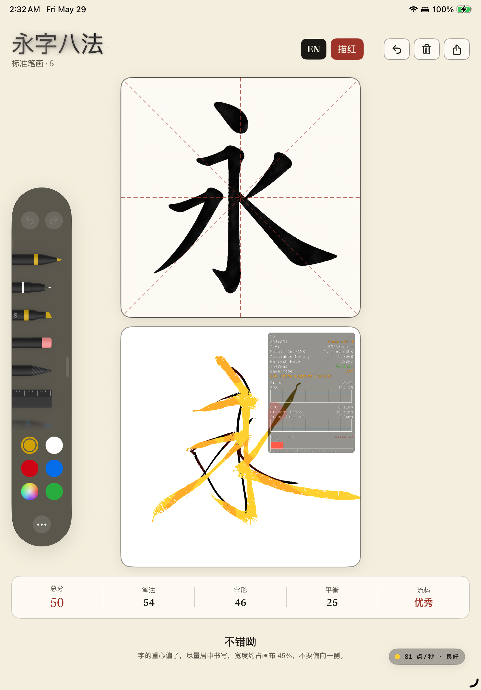
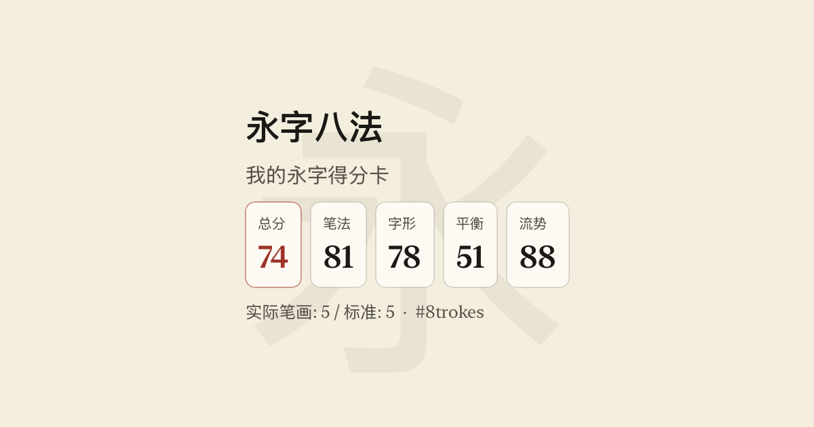

# MetalSolo (Part 1): Metal + SwiftUI Layer Compositing & Lifecycle Gotchas / MetalSolo（第一篇）：Metal + SwiftUI 图层合成与生命周期陷阱

<blockquote style="background-color: rgba(36, 41, 46, 0.05); border-left: 4px solid #8b5cf6; padding: 12px 16px; margin-bottom: 24px; border-radius: 0 8px 8px 0;">
  <strong>🎸 Series: MetalSolo (High-Performance GPU Programming)</strong>
  <ul style="margin-top: 8px; margin-bottom: 0; padding-left: 20px;">
    <li>👉 <strong>Part 1: Metal + SwiftUI Layer Compositing & Lifecycle Gotchas (Current)</strong></li>
    <li><strong>Part 2</strong>: <a href="/blog/metal-geometry-math-part2/">Sacred Geometry of Stylus Input & Ink Engine Math</a></li>
    <li><strong>Part 3</strong>: <a href="/blog/colored-icp-3d-point-cloud-registration/">Colored ICP Point Cloud Registration in 3D Scanning</a></li>
  </ul>
</blockquote>

## Solo Dev Meets the GPU / 一个人 vs GPU

Imagine hiring a classically trained violinist and asking them to play death metal. No coaching, no sheet music. Just hand them the guitar and say "you'll figure it out."
想象一下，雇一个受过古典训练的小提琴手，让他去演奏死亡金属。没有指导，没有乐谱。直接把吉他塞给他，说"你会搞定的"。

That's what it felt like to wire Metal into SwiftUI alone.
一个人把 Metal 接进 SwiftUI，就是这种感觉。

SwiftUI is elegant and declarative. Metal is a GPU pipeline that doesn't care about your feelings. Between them sits UIKit's compositing engine, which has its own opinions about where pixels actually end up — opinions it will not share with you until you've already wasted three days.
SwiftUI 优雅，声明式。Metal 是个 GPU 管线，不在乎你的感受。夹在中间的是 UIKit 的合成引擎，它对像素最终落在哪里有自己的看法——但它不会告诉你，直到你已经浪费了三天。

What follows are the bugs I hit while building **EightStrokes** — a digital ink engine for Chinese calligraphy. None of them produced a compiler warning. None crashed the app. They just silently produced wrong output and waited for me to figure out why.
以下是我在开发 **EightStrokes（永字八法）**——一个中文书法数字墨水引擎——时踩过的坑。没有一个产生编译警告，没有一个让应用崩溃。它们只是静默地输出错误的结果，然后等着我来搞清楚原因。

---

## 1. The SwiftUI Orientation Re-init Trap / 1. SwiftUI 屏幕旋转下的重复初始化陷阱

> **The Symptom:** Rotate the iPad. Everything looks fine — still 120 FPS. Then you glance at the Xcode console.
>
> **症状：** 旋转 iPad，一切看起来正常——依然 120 FPS。然后你瞟了一眼 Xcode 控制台。

```text
[CAMetalLayerDrawable texture] should not be called after already presenting this drawable.
[libMTLHud] Metric com.apple.hud-stat.frame-interval already exist.
```

It's spamming. Every rotation. I told myself it was probably fine.
每次旋转都在刷屏。我告诉自己可能没事。

It was not fine.
并没有没事。

### The Root Cause / 根本原因

I was handling portrait/landscape with a standard `if/else`:
我用标准的 `if/else` 处理竖/横屏：

```swift
// ❌ SwiftUI sees these as two distinct view trees
// ❌ SwiftUI 把这两个当成完全不同的视图树
if isLandscape {
    HStack(spacing: 16) { ReferencePanelView(); writingPanel }
} else {
    VStack(spacing: 16) { ReferencePanelView(); writingPanel }
}
```

SwiftUI doesn't know `writingPanel` in the `HStack` is the same thing as `writingPanel` in the `VStack`. Structural branching kills view identity. On every rotation, SwiftUI tears down the entire active tree and rebuilds the other branch — which means `makeUIView(context:)` fires a second time, spawning a second `MetalRenderer` on the same `MTLDevice`.
SwiftUI 不知道 `HStack` 里的 `writingPanel` 和 `VStack` 里的是同一个东西。结构性分支消灭了视图标识。每次旋转，SwiftUI 销毁整棵活跃视图树并重建另一棵——这意味着 `makeUIView(context:)` 被再次触发，在同一个 `MTLDevice` 上产生了第二个 `MetalRenderer`。

Two renderers. Same display link. Both trying to present the same drawable at the same frame boundary. That's the console spam.
两个渲染器，同一个 display link，同时试图在同一帧边界 present 同一个 drawable。这就是控制台在刷的原因。

### The Fix / 修复方案

iOS 16's `AnyLayout` lets you swap the layout algorithm *without* destroying the child tree. View identity survives the rotation.
iOS 16 的 `AnyLayout` 让你在*不销毁*子视图树的情况下切换布局算法。视图标识在旋转中得以保留。

```swift
// ✅ Same child tree, layout switches in-place
// ✅ 同一子视图树，布局原地切换
let canvasLayout: AnyLayout = isLandscape
    ? AnyLayout(HStackLayout(spacing: 16))
    : AnyLayout(VStackLayout(spacing: 16))

canvasLayout {
    ReferencePanelView()
    writingPanel  // makeUIView fires exactly once / makeUIView 只触发一次
}
```

Also add a re-entrancy guard as a safety net — if a duplicate renderer somehow gets created by a future SwiftUI update, it won't take down the frame:
同时加一个防重入锁作为安全网——万一未来 SwiftUI 更新意外产生了重复渲染器，不会把帧搞崩：

```swift
private var isDrawing = false

func draw(in view: MTKView) {
    guard !isDrawing else { return }
    isDrawing = true
    defer { isDrawing = false }
    // ...
}
```

---

## 2. The CALayer Hierarchy & ZStack Compositing Trap / 2. CALayer 图层树与 ZStack 的合成陷阱

> **The Symptom:** You put a pure SwiftUI view (like a red calligraphy template) *above* a `UIViewRepresentable` Metal view in a `ZStack`. The red character is completely invisible on the canvas — yet it mysteriously shows up underneath the semi-transparent Metal HUD.
>
> **症状：** 你把一个纯 SwiftUI 视图（如红色的临摹描红）放在 ZStack 中 `UIViewRepresentable` Metal 画布的*上方*。屏幕上红色的描红字形完全不出现——但诡异的是，它却能呈现在半透明的 Metal HUD 调试胶囊下方。

I had a red calligraphy character on a warm paper background — a `TraceReferenceView` — that users could follow to practice their strokes. It was supposed to float on top of the Metal canvas. I put it above `MetalCanvasView` in the `ZStack`. Ran the app. The red template character completely disappeared. It was invisible on the canvas, yet when I moved the semi-transparent debug HUD over it, it mysteriously showed up inside the capsule!
我有一个在宣纸背景上浮现红色“永”字字形的描红视图（`TraceReferenceView`）供用户临摹。它本应浮在 Metal 画布之上。我在 `ZStack` 里把它放在 `MetalCanvasView` 上方。运行 App 后，红色描红字体完全没有出现，画布上一片空白。但非常神奇的是，当我把半透明的调试 HUD 移动到对应位置时，描红字形居然在半透明胶囊的下方显现了出来！

```swift
// Looks correct — SwiftUI ZStack is bottom-to-top
// 看起来完全正确 —— SwiftUI ZStack 从底向上堆叠
ZStack {
    MetalCanvasView()           // UIViewRepresentable  ← lower / 底层
    TraceReferenceView()        // Pure SwiftUI         ← higher, should be on top / 顶层
}
```

My first instinct: opacity bug. Color bug. Frame bug. I checked all of them. The view was there, it just wasn't visible.
我的第一反应：是不是 opacity 问题？颜色问题？Frame 问题？全查了一遍，视图明明在，就是看不见。

### The Frosted Glass Moment / 磨砂玻璃的灵异时刻

I had a `BrushDebugHUD` — a floating debug capsule with `.ultraThinMaterial` background — for monitoring brush latency. During one late-night session I noticed something strange: the 永 ghost was appearing. But *only* inside the capsule.
我有一个 `BrushDebugHUD`——一个带 `.ultraThinMaterial` 背景的浮动调试胶囊，用来监控笔刷延迟。某个深夜，我注意到了一件诡异的事：永字描红出现了。但只在胶囊*内部*。

The frosted glass was seeing through the Metal canvas and revealing the hidden view underneath.
磨砂玻璃穿透了 Metal 画布，把隐藏在下面的视图给"透"出来了。



That screenshot was taken at 2:32 AM. I stared at it for a long time.
那张截图是凌晨 2:32 截的。我盯着它看了很久。

```text
SwiftUI ZStack (Logical / 逻辑顺序)     UIKit Layer Tree (Physical / 物理合成树)
───────────────────────────────     ──────────────────────────────────────────
TraceReferenceView  (Top / 顶)       ┌ Hosting UIView (UIHostingController)
                                     │  ├ CALayer (Parent's own content / 父级自身像素)
MetalCanvasView   (Bottom / 底)      │  │   └── [TraceReferenceView pixels here] ← BEHIND subviews
                                     │  └ MetalCanvasView (UIView subview / UIKit 子视图)
                                     │       └ CAMetalLayer  ← PHYSICALLY ON TOP of parent CALayer
                                     └
```

### Why It Happens / 根本原因

SwiftUI's `ZStack` is a **logical** order. UIKit's layer tree is **physical**.
SwiftUI 的 `ZStack` 是**逻辑**顺序。UIKit 的图层树是**物理**顺序。

When you embed a `UIViewRepresentable`, SwiftUI spawns a real `UIView` subview. In UIKit, subviews are *always* composited above their parent's own `CALayer` content — no exceptions.
嵌入 `UIViewRepresentable` 时，SwiftUI 会创建一个真实的 `UIView` subview。在 UIKit 里，subview *永远*在父 view 自身 CALayer 内容之上合成——没有例外。

SwiftUI does not guarantee that `ZStack`'s logical ordering maps to physical sublayer ordering when `UIViewRepresentable` is in the mix. Whether SwiftUI renders the sibling pure-SwiftUI content into the parent's backing layer, or inserts it as an earlier sublayer — the physical outcome is the same: the Metal canvas ends up on top. Silently.
当 `ZStack` 中混有 `UIViewRepresentable` 时，SwiftUI **不保证**逻辑顺序会映射到物理 sublayer 的插入顺序。无论是把纯 SwiftUI 内容合并进父 view 的 backing layer，还是作为较早的 sublayer 插入——物理结果相同：Metal canvas 跑到最上面。无声无息。

`.ultraThinMaterial` is backed by `UIVisualEffectView`, which captures screen content at the **IOSurface / compositor level** — below the UIKit layer tree. That's why it can see pixels that are visually occluded at the UIKit layer level, revealing the trapped `TraceReferenceView` beneath the Metal surface.
`.ultraThinMaterial` 底层是 `UIVisualEffectView`，它在 **IOSurface / compositor 层**捕获屏幕内容——低于 UIKit 图层树。这就是它能看到在 UIKit 层级上被遮挡的像素的原因，把压在 Metal 表面下的 `TraceReferenceView` 给"透"了出来。

### The Fix / 修复方案

Stop relying on `ZStack` position for anything above a `UIViewRepresentable`. Use `.overlay()` — it forces SwiftUI to create a dedicated UIView container, inserted as the *last* (topmost) subview.
不要再依赖 `ZStack` 位置来叠加 `UIViewRepresentable` 上面的东西。用 `.overlay()`——它强制 SwiftUI 创建一个独立的 UIView 容器，作为*最后*（最顶层）的 subview 插入。

```swift
// ❌ BEFORE — ZStack position doesn't guarantee physical layer order
// ❌ 之前 —— ZStack 位置不保证物理图层顺序
ZStack {
    MetalCanvasView()
    TraceReferenceView()   // logically above, physically below / 逻辑上在上，物理上在下
}

// ✅ AFTER — .overlay() guarantees a separate UIView on top
// ✅ 之后 —— .overlay() 保证独立 UIView 在物理最顶层
ZStack {
    MetalCanvasView()
}
.overlay {
    TraceReferenceView()
}
```

Also: `CAMetalLayer.isOpaque` defaults to `true`. Even if everything else is set correctly, the compositor will treat your Metal layer as a solid wall. Be explicit.
另外：`CAMetalLayer.isOpaque` 默认为 `true`。即使其他一切都设置正确，compositor 也会把你的 Metal 图层当成实心墙。必须显式设置。

```swift
let view = InkMTKView(frame: .zero)
view.isOpaque = false
view.backgroundColor = .clear
view.layer.isOpaque = false    // don't assume propagation / 不要假设会自动传播
```

---

## 3. The Transparent Background & Premultiplied Alpha Trap / 3. 透明背景与预乘 Alpha 陷阱

> **The Symptom:** You want a paper-textured background under the ink. You set `clearColor` to a warm paper tone with alpha zero, expecting transparency. The canvas is solid black.
>
> **症状：** 你想在墨水下方放一张宣纸纹理。把 `clearColor` 设成暖色宣纸色调、alpha 为零，期望透明。画布变成了纯黑色。

At this point I had already spent days on the ZStack bug. I set one color value. Black screen. I genuinely considered switching to SpriteKit.
这时我已经在 ZStack 那个 bug 上花了好几天。改了一个颜色值，黑屏。我认真考虑过换 SpriteKit。

### The Premultiplied Rule / 预乘法则

Metal's compositing pipeline uses **Premultiplied Alpha**. Every RGB component must be pre-multiplied by alpha before it reaches the compositor:
Metal 的合成管线使用**预乘 Alpha**。每个 RGB 分量在到达 compositor 之前必须预先乘以 alpha：

$$\text{Color}_{\text{premul}} = (R \times A,\ G \times A,\ B \times A,\ A)$$

This imposes a hard constraint: **RGB values can never exceed alpha** ($R, G, B \leq A$).
这带来一个硬性约束：**RGB 值绝对不能超过 alpha**（$R, G, B \leq A$）。

I set `clearColor` to `(0.97, 0.96, 0.92, 0)`. Metal itself doesn't validate this — it just writes those raw values into the `CAMetalLayer` texture as-is. The problem happens one step later, when Core Animation's compositor picks up that texture and tries to composite it using premultiplied blending:
我把 `clearColor` 设成了 `(0.97, 0.96, 0.92, 0)`。Metal 本身不校验这个值——它只是把这些原始值原封不动写进 `CAMetalLayer` 的 texture。问题发生在下一步，Core Animation compositor 拿到这张 texture，用预乘混合方式进行合成：

```text
result.rgb = src_premul.rgb + dst.rgb × (1 - src.a)
           = (0.97, 0.96, 0.92) + dst × (1 - 0)
           = RGB values go through fully, alpha channel is zero
```

The compositor received an invalid premultiplied state — RGB far exceeding alpha. The result is implementation-dependent: solid black, opaque gray, or something else. No error, no warning, just wrong.
compositor 收到的是无效的预乘状态——RGB 远超 alpha。结果是实现相关的行为：纯黑、不透明灰，或者别的什么。没有报错，没有警告，就是不对。

### The Fix / 修复方案

Clear to mathematical zero. Then put the paper texture in a SwiftUI layer *behind* the Metal view — let the transparent Metal layer overlay the ink strokes on top.
清空到数学上的零。然后把宣纸纹理放在 Metal 视图*后面*的 SwiftUI 图层里——让透明的 Metal 图层把墨水笔迹叠加在上面。

```swift
// ✅ Valid premultiplied zero — RGB ≤ A satisfied trivially
// ✅ 有效的预乘零值 —— RGB ≤ A 自然满足
mtkView.clearColor = MTLClearColor(red: 0, green: 0, blue: 0, alpha: 0)
```

---

## 4. The Render Pipeline Blend State Trap / 4. 渲染管线混合状态陷阱

> **The Symptom:** `clearColor` is valid. `isOpaque` is false. The canvas is transparent. But as soon as you draw a stroke, the background turns black underneath it.
>
> **症状：** `clearColor` 合法，`isOpaque` 已设为 false，画布是透明的。但一旦开始画笔迹，笔迹下面的背景就变黑了。

This is a separate bug that produces the same surface symptom as Gotcha 3, but at a different stage. The clearColor fix gets you a transparent canvas at rest. The render pipeline blend state controls what happens when you actually *draw* into it.
这是一个独立的 bug，和第 3 个坑表面症状相同，但发生在不同阶段。clearColor 修复解决的是静止时的透明画布。渲染管线的混合状态控制的是你实际*绘制*时发生的事。

### Default Blend Factors Are Opaque / 默认混合因子是不透明的

The default `MTLRenderPipelineDescriptor` has blending disabled, and the default blend factors are `(.one, .zero)` — meaning each draw call writes its RGB values opaquely over whatever was there, ignoring alpha entirely:
默认的 `MTLRenderPipelineDescriptor` 禁用了混合，默认混合因子是 `(.one, .zero)`——意味着每次 draw call 都会把自己的 RGB 值不透明地覆盖到原有内容上，完全忽略 alpha：

```swift
// ❌ Default — blending disabled, strokes punch solid holes in the background
// ❌ 默认 —— 混合禁用，笔迹在背景上打出实心洞
pipelineDescriptor.colorAttachments[0].isBlendingEnabled = false
// effectively: sourceRGBBlendFactor = .one, destinationRGBBlendFactor = .zero
```

Even with a perfectly transparent clearColor and `isOpaque = false`, every stroke call overwrites destination pixels with opaque color, making the underlying SwiftUI layers invisible in those regions.
即使 clearColor 完全合法、`isOpaque = false` 已设好，每次笔迹的 draw call 都会用不透明颜色覆写目标像素，让下面的 SwiftUI 图层在那些区域消失。

### The Fix / 修复方案

Enable blending and use standard premultiplied alpha factors:
开启混合并使用标准预乘 alpha 因子：

```swift
// ✅ Premultiplied alpha blending — strokes composite correctly over the background
// ✅ 预乘 alpha 混合 —— 笔迹正确叠加在背景上
let attachment = pipelineDescriptor.colorAttachments[0]
attachment.isBlendingEnabled = true
attachment.sourceRGBBlendFactor = .one               // src already premultiplied / src 已预乘
attachment.destinationRGBBlendFactor = .oneMinusSourceAlpha
attachment.sourceAlphaBlendFactor = .one
attachment.destinationAlphaBlendFactor = .oneMinusSourceAlpha
```

This is the standard setup for drawing transparent content. It's not the default because Metal's defaults are designed for opaque rendering pipelines where blending overhead is unwanted.
这是绘制透明内容的标准配置。之所以不是默认值，是因为 Metal 的默认设置是为不透明渲染管线设计的，那种场景下混合开销是不必要的。

---

## Putting It Together / 合并来看

Here's the thing: these four bugs produce similar symptoms but fire at completely different stages of the rendering pipeline. I hit all of them in roughly this order, each one masking or mimicking the one before.
关键在于：这四个 bug 症状相似，但在渲染管线的完全不同阶段触发。我大致按这个顺序踩遍了它们，每一个都在掩盖或模仿上一个。

```text
ZStack order wrong          → TraceReferenceView missing at compositing
isOpaque = true (default)   → Metal layer is a solid wall, nothing below shows
clearColor premul violation → CA compositor gets invalid texture, fallback color
Blend state disabled        → Strokes paint over background, destroying alpha
```

These are four *independent* causes. Fixing one doesn't fix the others. If `isOpaque` had been `true` from the start, I might never have seen the frosted glass clue for the ZStack bug — the whole layer would have been opaque and the symptoms would have blended together into one undifferentiated "why is everything wrong" session.
这是四个*独立*的原因。修一个不解决其他的。如果一开始 `isOpaque` 是 `true`，我可能永远看不到 ZStack bug 的磨砂玻璃线索——整个图层会是不透明的，所有症状会混在一起变成一个无法分辨的"为什么所有东西都不对"的 debug 会话。

---

## One Intense Night Later / 熬过一个通宵之后

Four bugs. Zero compile warnings. Zero crashes between them. All solved in one intense, sleepless night of relentless debugging.
四个 bug，零编译警告，彼此之间零崩溃。全都在一宿没睡、死磕到底的极限 Debug 战役中被彻底搞定。

After fixing all of them, the ink engine worked. The paper texture showed through. The trace reference floated on top. Rotations were smooth and silent. I submitted to the App Store.
全修好之后，墨水引擎跑起来了。宣纸纹理透了出来，描红视图浮在最上方，旋转平滑无声。我提交了 App Store。



That scorecard — total 74, stroke order 81, flow 88 — was the first thing I shared after the whole thing compiled, ran, scored, and didn't explode. Good enough.
那张得分卡——总分 74，笔法 81，流势 88——是整个东西能编译、能运行、能评分、没炸掉之后我分享的第一张。够了。

---

## The Pattern / 规律总结

All four bugs share one trait: they are **physically correct but logically wrong** from the SwiftUI developer's perspective. The OS did exactly what it was supposed to do. I just didn't know the rules.
四个 bug 有一个共同点：从 SwiftUI 开发者视角看，它们**物理上正确，逻辑上错误**。操作系统做了它该做的事，只是我不知道规则。

| Gotcha | Root cause / 根本原因 | Stage / 触发阶段 | Silent? / 静默? |
| --- | --- | --- | --- |
| Orientation re-init | `if/else` branching destroys view identity, double-allocates Metal renderer | Layout / 布局 | Semi-silent / 半静默 (Console warning / 控制台警告) |
| ZStack compositing | SwiftUI doesn't guarantee logical→physical sublayer order when UIViewRepresentable is mixed in | Compositing / 合成 | ✅ (Fully silent / 完全静默) |
| Premultiplied alpha | Invalid RGB > A in clearColor — CA compositor gets undefined-behavior input | CA compositor / CA 合成器 | ✅ (Fully silent / 完全静默) |
| Blend state disabled | Default pipeline factors `.one / .zero` ignore alpha on every draw call | Render pipeline / 渲染管线 | ✅ (Fully silent / 完全静默) |

In [Part 2](/blog/metal-geometry-math-part2/), we dive deep into the vector ink geometry: how raw Pencil inputs are smoothed using Catmull-Rom splines, and the exact math behind generating variable-width triangle strips for smooth rendering.
[第二篇](/blog/metal-geometry-math-part2/)进入几何部分：剖析我们如何将原始 Pencil 触点转换为平滑的 Catmull-Rom 样条，以及如何通过数学公式生成可变宽度的三角带。

Keep your strokes clean.
落笔要稳。
