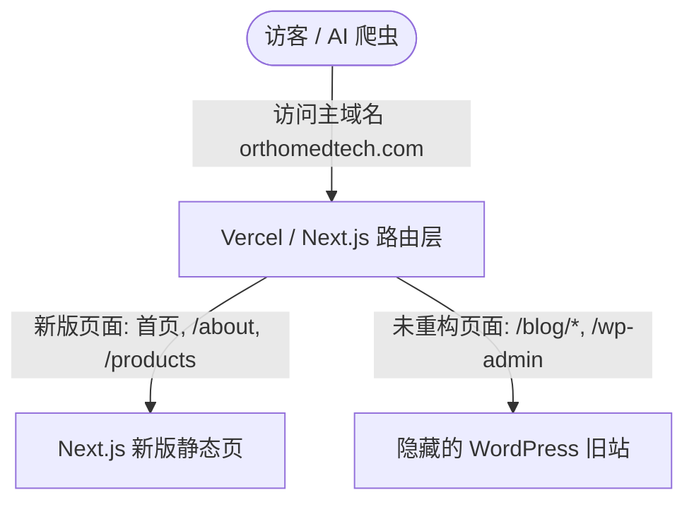

在当今的 Web 生态中，商业和营销站点（Marketing & Business Sites）正面临着双重挑战：一方面需要通过**传统搜索引擎（SEO）**获取持续的自然流量，另一方面需要优化网站架构以迎合**生成式 AI 搜索引擎（GEO）**（如 ChatGPT Search, Perplexity）的语义检索与直接引用。

本篇文档以两个真实的商业站点重构为例，深入探讨如何进行架构规划、框架选型、托管成本控制以及 SEO/GEO 的综合优化。

---

## 一、 两个典型商业站点的现状与痛点

在制定重构方案前，我们先定义两个具备代表性的重构标的：

### 1. 案例 A：VitalMark.health（消费者 Landing Page / IoT 产品官网）
* **现状**：使用普通的 React 单页应用（CSR，基于 Create React App）构建。
* **痛点**：
  * **SEO/GEO 极差**：原始 HTML 是一个空壳（仅包含 `<div id="root">`），内容全靠浏览器端执行 JS 渲染。AI 爬虫和部分搜索引擎爬虫直接抓到空页面。
  * **加载性能慢**：用户需要下载并执行庞大的 JS Bundle 才能看到页面，导致 FCP（首次内容绘制）时间过长。

### 2. 案例 B：OrthoMedtech.com（B2B 医疗科技官网）
* **现状**：现运行于 WordPress 系统，拥有大量存量的博客文章和高权重的 SEO 历史链接，设计师正在对其进行视觉重新设计。
* **痛点**：
  * **旧系统尾大不掉**：如果完全抛弃 WordPress 重写，会丢失多年积累的 SEO 域名权重，且运营人员需要重新学习内容发布后台。
  * **性能瓶颈**：传统主机部署的 WordPress 响应速度慢，缺乏全球边缘加速能力。

---

## 二、 重构方案设计与平滑迁移策略

针对上述两个站点，我们设计了不同的渐进式重构路线：

### 1. VitalMark.health：迁移至 Astro 或 Next.js 静态导出 (SSG)
由于该站点是一个相对静态的产品落地页加 App 引导，核心痛点是**加载速度**和**SEO**：

* **方案**：使用 **Astro**（首选）或 **Next.js (Static Export)** 重写。
* **Astro 的优势**：
  * **0 字节 JS 载入**：Astro 在编译时生成纯 HTML，默认不向浏览器发送任何 JavaScript，带来极致的首屏速度与完美的 Lighthouse 跑分。
  * **孤岛架构**：若页面中需要动态的交互组件（如“设备兼容性查询”），仅为该组件载入 JS，其余部分保持静态。
* **托管决策**：由于导出为纯静态资源，可部署在 **Cloudflare Pages** 或 **Netlify** 上，享受**完全免费且无商业限制**的全球边缘 CDN 加速。

### 2. OrthoMedtech.com：Next.js 反向代理（Rewrites）平滑过渡
为了在不抛弃老 WordPress 站点的历史文章和后台系统的前提下上线新版设计，我们采用 **Next.js 反向代理** 方案：



* **方案实施**：
  1. 将原有 WordPress 站点修改域名为 `wp-backend.orthomedtech.com` 并继续运行。
  2. 新设计的页面用 Next.js 开发，并将主域名 `orthomedtech.com` 指向 Vercel。
  3. 在 Next.js 的 [next.config.js](file:///Users/zhangyiwei/Documents/VitalMark-Cardiac/docs/architecture/website_refactoring_and_seo_geo_strategy.md#L83) 中配置静默代理规则：
     ```javascript
     module.exports = {
       async rewrites() {
         return [
           // 保持后台管理可用
           { source: '/wp-admin/:path*', destination: 'https://wp-backend.orthomedtech.com/wp-admin/:path*' },
           // 保持老博客与素材直达旧站，URL 保持主域名不变
           { source: '/blog/:path*', destination: 'https://wp-backend.orthomedtech.com/blog/:path*' },
           { source: '/wp-content/:path*', destination: 'https://wp-backend.orthomedtech.com/wp-content/:path*' }
         ];
       }
     };
     ```
* **优势**：
  * **SEO 零损失**：历史链接完美保留，域名权重不流失。
  * **开发无压力**：新老系统并存，可以今天改首页，下个月改产品页，逐步替换。

---

## 三、 全栈框架选型：Next.js vs. TanStack Start

对于商业和营销网站，在 **Next.js** 和最近火热的 **TanStack Start** 之间，我们有清晰的选型标准：

| 维度 | **Next.js (App Router / SSG)** | **TanStack Start (全栈框架)** |
| :--- | :--- | :--- |
| **首选场景** | **营销官网、内容站、电商、SEO/GEO 敏感型站点** | **复杂后台、SaaS 面板、强数据交互型 App** |
| **主要优势** | * 静态图片自动压缩与按需裁剪 (`next/image`)。<br>* 字体自动预加载与脚本优化布局。<br>* 极度庞大且成熟的第三方 SEO/Analytics 生态。 | * 100% 深度类型安全 (Type-Safe Routing)。<br>* 极其强大的 URL 查询参数（Search Params）状态同步。<br>* 与 TanStack Query 完美集成。 |
| **静态优化** | 极其成熟的 SSG/ISR 机制，配合全局 CDN。 | 新兴全栈，偏向 SSR/RPC 模式，对纯静态导出的优化还在演进。 |

**选型结论**：
对于 VitalMark 和 OrthoMedtech 这类内容驱动、强 SEO/GEO 诉求的商业官网，**Next.js (或 Astro) 是更好的选择**；但如果要为它们开发配对的“医生管理后台”或“患者健康数据监测面板”，**TanStack Start** 的开发体验和类型安全性则会更胜一筹。

---

## 四、 云托管方案对比与财务核算

老板和财务团队往往对技术栈重构的“运行成本”极度敏感。下表为四类托管方案的深度对比：

| 维度 | **Vercel** (Serverless) | **Cloudflare Pages / Netlify** | **DigitalOcean Droplet** (VPS) | **传统主机** (如 Network Solutions) |
| :--- | :--- | :--- | :--- | :--- |
| **商业版费用** | **$20/月 / 开发者席位** | **$0/月** (静态托管商业免费) | **$4 - $12/月** (按配置计费) | **$10 - $30/月** (通常需按年预付) |
| **运维开发工时** | **几乎为 0** (Git 推送自动部署) | **几乎为 0** (Git 推送自动部署) | **极高** (需自己配置 Linux, SSL, Nginx) | **一般** (老旧的 FTP 上传) |
| **性能体验** | 极佳（自动边缘 Serverless 运行） | 极佳（利用 Cloudflare 顶级 CDN） | 平均（单节点部署，需另接 CDN） | 差（共享 CPU，响应慢） |

### ⚠️ 商业费用的关键考量
1. **Vercel 的免费版（Hobby）严格限制商业用途**。因此，OrthoMedtech 和 VitalMark 如果使用 Next.js 动态路由功能部署在 Vercel 上，**法律上必须购买 Pro 计划（$20/月/开发者）**。
   * *注：只需为推代码的开发席位付费，非技术管理者和客户预览无需付费。*
2. **Astro + Cloudflare Pages 的免费组合**：
   如果像 VitalMark 这样纯粹是静态页面，我们推荐用 Astro 打包成纯静态 HTML，部署到 Cloudflare Pages 上。**静态托管平台对商业项目依然提供免费额度**，这可以帮助公司合法实现 **$0/月** 的托管开销。
3. **不要为了省钱而使用自建 VPS (DigitalOcean)**：
   虽然 DO Droplet 每月只需 $6，但为了维护这台服务器，开发人员需要处理 OS 安全漏洞补丁、SSL 证书自动更新续签、防 DDOS 攻击、解决 Node 进程崩溃当机等。**自建运维所消耗的开发工时成本，远远超过了 Vercel 每月 $20 的订阅费。**

---

## 五、 SEO & GEO 的落地实操策略

不管是 Next.js 还是 Astro，重构的终极目的是带来流量。在内容层面我们需要做到：

### 1. 技术底座 (SEO)
* 避免使用 CSR。使用预渲染（SSG）或按需更新（ISR）确保爬虫请求时，原始 HTML 已经填满了文字。
* 每一个页面都必须通过组件动态输出独立的 `<title>`、`<meta name="description">` 以及 Canonical URL，防止镜像站分流。

### 2. 迎合 AI 引擎提炼 (GEO)
AI 搜索引擎依靠 **RAG 机制** 将网页文字切片提炼。我们在编写文章、介绍医疗器械或 IoT 贴片时，必须遵循以下规则：
* **BLUF 结构 (结论先行)**：在所有段落开头，用 60 字以内的粗体段落直白地回答“该产品是什么/有什么用”。AI 极度偏好直接抓取这行字。
* **数据表格化**：用 Markdown 绘制参数对比表（如芯片参数、续航、材质）。Perplexity 等引擎在回答对比类提问时，会直接在聊天框里渲染该表格并附带来源链接。
* **FAQ 与问题式标题**：使用用户会向 AI 提问的口吻做 H3 标题（例如 `### OrthoMedtech 假体关节在手术中有什么优势？`），并在下方立即给出解答。
